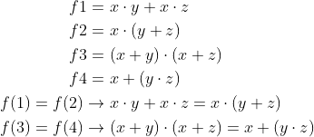

# LAB01 - Gates

## Link to my GitHub repository

https://github.com/xruine00/Digital-electronics-1

## De Morgan's laws

**Equations for the implementation of gates:**


**The truth table:**
| **c** | **b** |**a** | **f(c,b,a)** |
| :-: | :-: | :-: | :-: |
| 0 | 0 | 0 | 1 |
| 0 | 0 | 1 | 1 |
| 0 | 1 | 0 | 0 |
| 0 | 1 | 1 | 0 |
| 1 | 0 | 0 | 0 |
| 1 | 0 | 1 | 1 |
| 1 | 1 | 0 | 0 |
| 1 | 1 | 1 | 0 |

**Screenshot with time waveforms:**


**Defined functions in VHDL:**
```vhdl
architecture dataflow of gates is
begin
    f_o     <= ((not b_i) and a_i) or ((not c_i) and (not b_i));
    fnand_o <= ((not b_i) nand a_i) nand ((not c_i) nand (not b_i));
    fnor_o  <= (b_i nor (not a_i)) or (c_i nor b_i);

end architecture dataflow;
```

**Link to the EDA Playground:**

https://www.edaplayground.com/x/QuTC

## Distributive laws

**Equations for the implementation of gates:**


**The truth table for f1 and f2:**
| **x** | **y** |**z** | **f(x,y,z)** |
| :-: | :-: | :-: | :-: |
| 0 | 0 | 0 | 0 |
| 0 | 0 | 1 | 0 |
| 0 | 1 | 0 | 0 |
| 0 | 1 | 1 | 0 |
| 1 | 0 | 0 | 0 |
| 1 | 0 | 1 | 1 |
| 1 | 1 | 0 | 1 |
| 1 | 1 | 1 | 1 |

**The truth table for f3 and f4:**
| **x** | **y** |**z** | **f(x,y,z)** |
| :-: | :-: | :-: | :-: |
| 0 | 0 | 0 | 0 |
| 0 | 0 | 1 | 0 |
| 0 | 1 | 0 | 0 |
| 0 | 1 | 1 | 1 |
| 1 | 0 | 0 | 1 |
| 1 | 0 | 1 | 1 |
| 1 | 1 | 0 | 1 |
| 1 | 1 | 1 | 1 |

**Screenshot with time waveforms:**


**Link to the EDA Playground:**

https://www.edaplayground.com/x/GG_2
