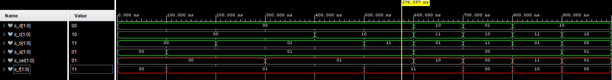

# Lab03 - Introduction to Vivado

## Preparation tasks

### Nexys A7 board - table of slide switches connected to I/O pins

| SW | R | PIN |
| :-: | :-: | :-: |
| SW0 | R35 - 10K | J15 |
| SW1 | R37 - 10K | L16 |
| SW2 | R38 - 10K | M13 |
| SW3 | R40 - 10K | R15 |
| SW4 | R42 - 10K | R17 |
| SW5 | R43 - 10K | T18 |
| SW6 | R46 - 10K | U18 |
| SW7 | R48 - 10K | R13 |
| SW8 | R56 - 10K | T8 |
| SW9 | R58 - 10K | U8 |
| SW10 | R64 - 10K | R16 |
| SW11 | R66 - 10K | T13 |
| SW12 | R68 - 10K | H6 |
| SW13 | R69 - 10K | U12 |
| SW14 | R71 - 10K | U11 |
| SW15 | R73 - 10K | V10 |

### Nexys A7 board - table of LEDS connected to I/O pins

| LED | R | PIN |
| :-: | :-: | :-: |
| LED0 | R33 - 330 | H17 |
| LED1 | R34 - 330 | K15 |
| LED2 | R36 - 330 | J13 |
| LED3 | R39 - 330 | N14 |
| LED4 | R41 - 330 | R18 |
| LED5 | R44 - 330 | V17 |
| LED6 | R47 - 330 | U17 |
| LED7 | R50 - 330 | U16 |
| LED8 | R52 - 330 | V16 |
| LED9 | R54 - 330 | T15 |
| LED10 | R57 - 330 | U14 |
| LED11 | R65 - 330 | T16 |
| LED12 | R67 - 330 | V15 |
| LED13 | R70 - 330 | V14 |
| LED14 | R72 - 330 | V12 |
| LED15 | R74 - 330 | V11 |

## Two-bit wide 4-to-1 multiplexer

### VHDL architecture from source file

```vhdl
architecture Behavioral of mux_2bit_4to1 is
begin
    f_o    <= a_i when (sel_i = "00") else
              b_i when (sel_i = "01") else
              c_i when (sel_i = "10") else
              d_i;

end architecture Behavioral;
```

### VHDL stimulus process from testbench file

```vhdl
p_stimulus : process
    begin
        -- Report a note at the begining of stimulus process
        report "Stimulus process started" severity note;


        s_d   <= "00"; s_c <= "00"; s_b <= "00"; s_a <= "00";
        s_sel <= "00"; wait for 100 ns;  

        s_a   <= "01"; wait for 100 ns;
        s_b   <= "01"; wait for 100 ns;

        s_sel <= "01"; wait for 100 ns;
        s_c   <= "00"; wait for 100 ns;
        s_b   <= "11"; wait for 100 ns;

        s_d   <= "10"; s_c <= "11"; s_b <= "01"; s_a <= "00";
        s_sel <= "10"; wait for 100 ns;

        s_d   <= "01"; s_c <= "10"; s_b <= "11"; s_a <= "00";
        s_sel <= "00"; wait for 100 ns;

        s_d   <= "10"; s_c <= "11"; s_b <= "01"; s_a <= "00";
        s_sel <= "11"; wait for 100 ns;

        s_d   <= "10"; s_c <= "10"; s_b <= "00"; s_a <= "01";
        s_sel <= "01"; wait for 100 ns;

        -- Report a note at the end of stimulus process
        report "Stimulus process finished" severity note;
        wait;
    end process p_stimulus;
```

### Simulated time waveforms


