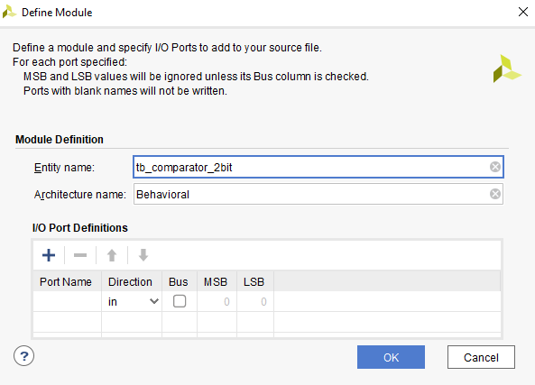

# Lab03 - Introduction to Vivado

## Preparation tasks

### Nexys A7 board - table of slide switches connected to I/O pins

| SW | R [Ω] | PIN |
| :-: | :-: | :-: |
| SW0 | R35 - 10K | J15 |
| SW1 | R37 - 10K | L16 |
| SW2 | R38 - 10K | M13 |
| SW3 | R40 - 10K | R15 |
| SW4 | R42 - 10K | R17 |
| SW5 | R43 - 10K | T18 |
| SW6 | R46 - 10K | U18 |
| SW7 | R48 - 10K | R13 |
| SW8 | R56 - 10K | T8 |
| SW9 | R58 - 10K | U8 |
| SW10 | R64 - 10K | R16 |
| SW11 | R66 - 10K | T13 |
| SW12 | R68 - 10K | H6 |
| SW13 | R69 - 10K | U12 |
| SW14 | R71 - 10K | U11 |
| SW15 | R73 - 10K | V10 |

### Nexys A7 board - table of LEDS connected to I/O pins

| LED | R [Ω] | PIN | V connect |
| :-: | :-: | :-: | :-: |
| LED0 | R33 - 330 | H17 | Active High |
| LED1 | R34 - 330 | K15 | Active High |
| LED2 | R36 - 330 | J13 | Active High |
| LED3 | R39 - 330 | N14 | Active High |
| LED4 | R41 - 330 | R18 | Active High |
| LED5 | R44 - 330 | V17 | Active High |
| LED6 | R47 - 330 | U17 | Active High |
| LED7 | R50 - 330 | U16 | Active High |
| LED8 | R52 - 330 | V16 | Active High |
| LED9 | R54 - 330 | T15 | Active High |
| LED10 | R57 - 330 | U14 | Active High |
| LED11 | R65 - 330 | T16 | Active High |
| LED12 | R67 - 330 | V15 | Active High |
| LED13 | R70 - 330 | V14 | Active High |
| LED14 | R72 - 330 | V12 | Active High |
| LED15 | R74 - 330 | V11 | Active High |

## Two-bit wide 4-to-1 multiplexer

### VHDL architecture from source file

```vhdl
architecture Behavioral of mux_2bit_4to1 is
begin
    f_o    <= a_i when (sel_i = "00") else
              b_i when (sel_i = "01") else
              c_i when (sel_i = "10") else
              d_i;

end architecture Behavioral;
```

### VHDL stimulus process from testbench file

```vhdl
p_stimulus : process
    begin
        -- Report a note at the begining of stimulus process
        report "Stimulus process started" severity note;


        s_d   <= "00"; s_c <= "00"; s_b <= "00"; s_a <= "00";
        s_sel <= "00"; wait for 100 ns;  

        s_a   <= "01"; wait for 100 ns;
        s_b   <= "01"; wait for 100 ns;

        s_sel <= "01"; wait for 100 ns;
        s_c   <= "10"; wait for 100 ns;
        s_b   <= "11"; wait for 100 ns;

        s_d   <= "10"; s_c <= "11"; s_b <= "01"; s_a <= "00";
        s_sel <= "10"; wait for 100 ns;

        s_d   <= "01"; s_c <= "10"; s_b <= "11"; s_a <= "00";
        s_sel <= "00"; wait for 100 ns;

        s_d   <= "10"; s_c <= "11"; s_b <= "01"; s_a <= "00";
        s_sel <= "11"; wait for 100 ns;

        s_d   <= "10"; s_c <= "10"; s_b <= "00"; s_a <= "01";
        s_sel <= "01"; wait for 100 ns;

        -- Report a note at the end of stimulus process
        report "Stimulus process finished" severity note;
        wait;
    end process p_stimulus;
```

### Simulated time waveforms


## Vivado tutorial

### Project creation

**1.** Select *Create Project*

  - 1st way

  

  - 2nd way

  

**2.** Select next  


**3.** Select a name of a project and location, where the project will be saved. Leave the *Create project subdirectory* checked.


**Beware of spaces and punctuation in a name. This could cause troubles!**

**4.** Select the *RTL Project*. Basically, we will use only this option.


**5.** In the **Add Sources** tab we will add source codes (like *design.vhd* in EDA Playground).

  - After clicking on *Create File* the tab *Create Source File* will open. Here we select *File type* **VHDL** and insert the same name to *File name* as the entity name. Then select OK.

  

  - Note that we should choose *Target language* and *Simulator language* to **VHDL**, even though this could be changed later in options.

  

**6.** In the *Add Constraints (optional)* we can specify, which signals will be connected to which pins (can be added later). When we don´t have real HW, we don´t need to add any constraints.


**7.** In the *Default Part* we select the type of FPGA we´re gonna use or one of the prepared boards, where everything is already set (I/O pins...). We select Nexys A7-50T.


**8.** In the last tab *New Project Summary* is a brief overview of what we have selected in the previous steps. After clicking on *Finish* the project will be created.


**9.** In the *Define Module* we select the *Entity name* and *Architecture name*. Basically, we can leave it on the default settings. There is no need to specify *I/O Port Definitions* as we will specify it in the source code.


**10.** Click on *Yes* when asked to use the values that didn´t change.


### Adding source file

**1.** To add a new source file click on *File* -> *Add Sources...*


### Adding testbench file

**1.** To add a testbench file, we have to choose **simulation sources** from the *Add Sources* tab. Then click *next*.


**2.** Now the process of creating file is the same as in the **step 5 of Project creation**, except we will add `tb_` to the beginning of the *entity name*.


**3.** Still there is no need to specify *I/O Port Definitions* as we will specify it in the source code (same as in the **step 9 of Project creation**).



**4.** Click on *Yes* when asked to use the values that didn´t change.

### Adding XDC constraints file

**1.** From the link (https://github.com/Digilent/digilent-xdc) we select our board (Nexys-A7-50T-Master.xdc) and copy the whole content of the file.

**2.** Then we create new *constraints file*


**3.** In the *Add or Create Constraints* we select *Create File* and then fill in the **board name** as *File name* and select *OK*, then *Finish* (the only available `File type` is **XDC**).

**4.** We open the newly created file and paste in the content from **step 1**.

**5.** We assign signals to pins.
  - Everything that begins with **#** is a comment. To make a line code, we have to remove the # symbol.

  - **We map input signals to switches and output signals to LEDs.**

  - Each signal has to have own pin (e.g. 2-bit input A has to have `a_i[0]` mapped to `SW0` and `a_i[1]` mapped to `SW1`).

  

### Running simulation

**1.** To run a simulation, click on *Flow* -> *Run Simulation* -> *Run Behavioral Simulation*


  - Another way is to click on *Run Simulation* in the side bar.

  
