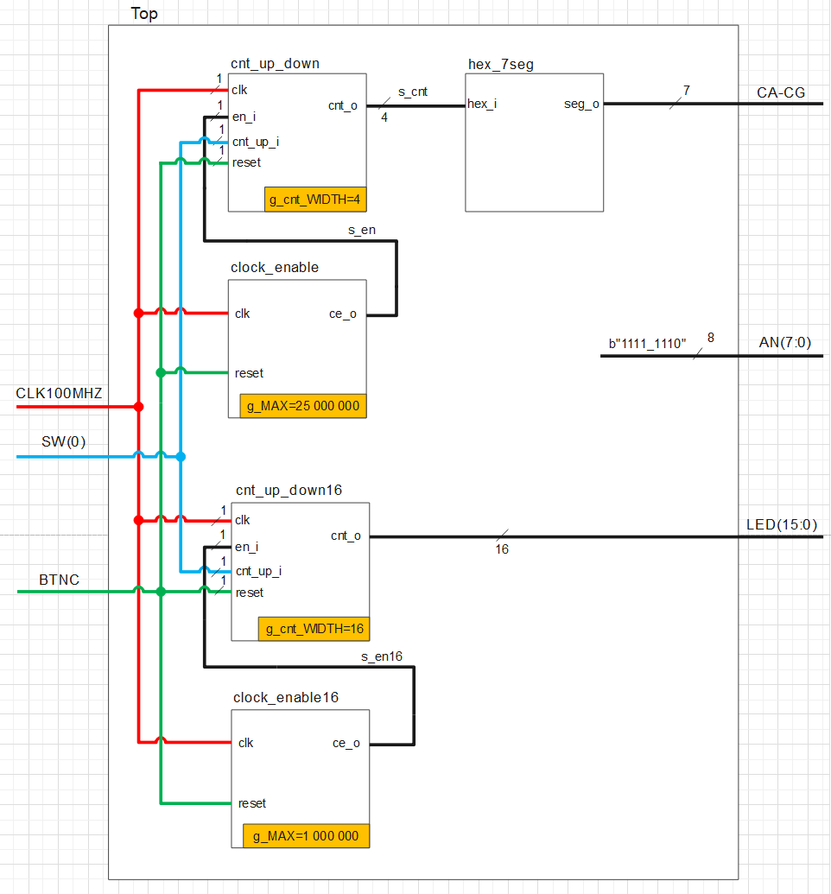

# Lab 5: Binary counter

## Preparation tasks

### Table with connection of push buttons on Nexys A7 board

  - Connected to 3.3 V power supply.
  - When pressed, logic high voltage is applied to their respective I/O pin.
  - When not pressed, logic low voltage is applied to their respective I/O pin.

| **Button** | **Pin** |
   | :-: | :-: |
   | BTNL | P17 |
   | BTNR | M17 |
   | BTNU | M18 |
   | BTND | P18 |
   | BTNC | N17 |

### Table with calculated values

| **Time interval** | **Number of clk periods** | **Number of clk periods in hex** | **Number of clk periods in binary** |
   | :-: | :-: | :-: | :-: |
   | 2&nbsp;ms | 200 000 | `x"3_0d40"` | `b"0011_0000_1101_0100_0000"` |
   | 4&nbsp;ms | 400 000 | `x"6_1a80"` | `b"0110_0001_1010_1000_0000"` |
   | 10&nbsp;ms | 1 000 000 | `x"f_4240"` | `b"1111_0100_0010_0100_0000"` |
   | 250&nbsp;ms | 25 000 000 | `x"17d_7840"` | `b"0001_0111_1101_0111_1000_0100_0000"` |
   | 500&nbsp;ms | 50 000 000 | `x"2fa_f080"` | `b"0010_1111_1010_1111_0000_1000_0000"` |
   | 1&nbsp;sec | 100 000 000 | `x"5f5_e100"` | `b"0101_1111_0101_1110_0001_0000_0000"` |

## Bidirectional counter

### VHDL code of the process `p_cnt_up_down`

```vhdl
p_cnt_up_down : process(clk)
   begin
       if rising_edge(clk) then

           if (reset = '1') then               -- Synchronous reset
               s_cnt_local <= (others => '0'); -- Clear all bits

           elsif (en_i = '1') then       -- Test if counter is enabled

               -- TEST COUNTER DIRECTION HERE
               if (cnt_up_i = '1') then
                   s_cnt_local <= s_cnt_local + 1;

               else
                   s_cnt_local <= s_cnt_local - 1;   

               end if;    
           end if;
       end if;
end process p_cnt_up_down;
```

### VHDL reset and stimulus processes from testbench file `tb_cnt_up_down.vhd`

```vhdl
    --------------------------------------------------------------------
    -- Reset generation process
    --------------------------------------------------------------------
    p_reset_gen : process
    begin
        s_reset <= '0';
        wait for 12 ns;
        assert (s_cnt="XXXXX")
        report "Button was pushed in the past" severity error;

        -- Reset activated
        s_reset <= '1';
        wait for 73 ns;
        assert (s_cnt="00000")
        report "Test failed for reset value 1" severity error;

        s_reset <= '0';
        wait;
    end process p_reset_gen;

    --------------------------------------------------------------------
    -- Data generation process
    --------------------------------------------------------------------
    p_stimulus : process
    begin
        report "Stimulus process started" severity note;

        -- Enable counting
        s_en     <= '1';

        -- Change counter direction
        s_cnt_up <= '1';
        wait for 480 ns;
        assert (s_cnt="01000")
        report "Test failed for count up" severity error;
        s_cnt_up <= '0';
        wait for 220 ns;
        assert (s_cnt="10010")
        report "Test failed for count down" severity error;

        -- Disable counting
        s_en     <= '0';

        report "Stimulus process finished" severity note;
        wait;
    end process p_stimulus;
```

### Screenshots with simulated time waveforms

  - 0-260 ns
  

  - 260-520 ns
  

  - 520-760 ns
  

## Top level

### VHDL code from source file `top.vhd` with all instantiations for the 4-bit bidirectional counter

```vhdl
    --------------------------------------------------------------------
    -- Instance (copy) of clock_enable entity
    clk_en0 : entity work.clock_enable
        generic map(
            --- WRITE YOUR CODE HERE
            g_MAX => 100000000
        )
        port map(
            --- WRITE YOUR CODE HERE
            clk    => CLK100MHZ,
            reset  => BTNC,
            ce_o   => s_en

        );

    --------------------------------------------------------------------
    -- Instance (copy) of cnt_up_down entity
    bin_cnt0 : entity work.cnt_up_down
        generic map(
            --- WRITE YOUR CODE HERE
            g_CNT_WIDTH => 4
        )
        port map(
            --- WRITE YOUR CODE HERE
            clk        => CLK100MHZ,
            reset      => BTNC,
            en_i       => s_en,
            cnt_up_i   => SW(0),
            cnt_o      => s_cnt
        );

    -- Display input value on LEDs
    LED(3 downto 0) <= s_cnt;

    --------------------------------------------------------------------
    -- Instance (copy) of hex_7seg entity
    hex2seg : entity work.hex_7seg
        port map(
            hex_i    => s_cnt,
            seg_o(6) => CA,
            seg_o(5) => CB,
            seg_o(4) => CC,
            seg_o(3) => CD,
            seg_o(2) => CE,
            seg_o(1) => CF,
            seg_o(0) => CG
        );
```

### Image of the top layer including both counters


