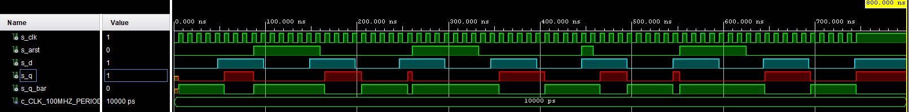
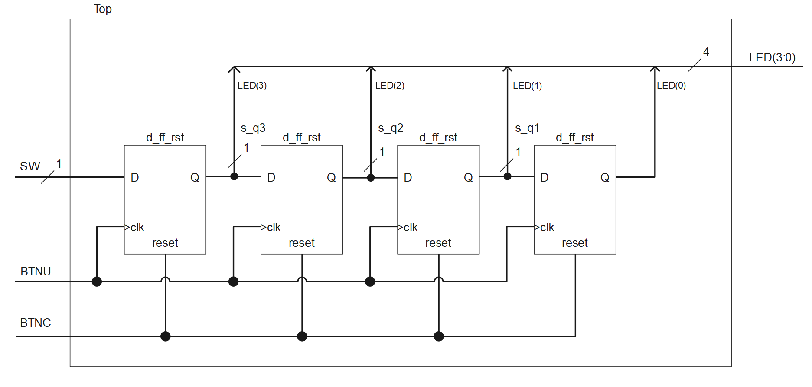

# Lab 7: Latches and Flip-flops

## Preparation tasks


| **clk** | **d** | **q(n)** | **q(n+1)** | **Comments** |
| :-: | :-: | :-: | :-: | :-- |
| ↑ | 0 | 0 | 0 | Input signal is sampled at the rising edge of clk and stored to FF |
| ↑ | 0 | 1 | 0 | Input signal is sampled at the rising edge of clk and stored to FF |
| ↑ | 1 | 0 | 1 | Input signal is sampled at the rising edge of clk and stored to FF |
| ↑ | 1 | 1 | 1 | Input signal is sampled at the rising edge of clk and stored to FF |

| **clk** | **j** | **k** | **q(n)** | **q(n+1)** | **Comments** |
| :-: | :-: | :-: | :-: | :-: | :-- |
| ↑ | 0 | 0 | 0 | 0 | No change |
| ↑ | 0 | 0 | 1 | 1 | No change |
| ↑ | 0 | 1 | 0 | 0 | Reset |
| ↑ | 0 | 1 | 1 | 0 | Reset |
| ↑ | 1 | 0 | 0 | 1 | Set |
| ↑ | 1 | 0 | 1 | 1 | Set |
| ↑ | 1 | 1 | 0 | 1 | Toggle |
| ↑ | 1 | 1 | 1 | 0 | Toggle |

| **clk** | **t** | **q(n)** | **q(n+1)** | **Comments** |
| :-: | :-: | :-: | :-: | :-- |
| ↑ | 0 | 0 | 0 | No change |
| ↑ | 0 | 1 | 1 | No change |
| ↑ | 1 | 0 | 1 | Invert (Toggle) |
| ↑ | 1 | 1 | 0 | Invert (Toggle) |

## D latch

### VHDL code listing of the process `p_d_latch`

```vhdl
p_d_latch : process (d, arst, en)
   begin
       if (arst = '1') then
           q     <= '0';
           q_bar <= '1';
       elsif (en = '1') then
           q     <= d;
           q_bar <= not d;
       end if;
end process p_d_latch;
```

### Listing of VHDL reset and stimulus processes from the testbench `tb_d_latch.vhd`

```vhdl
--------------------------------------------------------------------
-- Reset generation process
--------------------------------------------------------------------
p_reset_gen : process
begin

    s_arst <= '0';
    wait for 50 ns;

    s_arst <= '1';
    wait for 60 ns;
    assert(s_q = '0' and s_q_bar = '1')
    report "Test failed for reset value 1" severity error;

    s_arst <= '0';
    wait for 100 ns;
    assert(s_q = '1' and s_q_bar = '0')
    report "Test failed for reset value 0" severity error;

    s_arst <= '1';
    wait for 53 ns;
    assert(s_q = '0' and s_q_bar = '1')
    report "Test failed for reset value 1" severity error;

    s_arst <= '0';
    wait for 74 ns;
    assert(s_q = s_d and s_q_bar = (not s_d))
    report "Test failed for reset value 0" severity error;

    s_arst <= '1';
    wait for 53 ns;
    assert(s_q = '0' and s_q_bar = '1')
    report "Test failed for reset value 1" severity error;

    s_arst <= '0';
    wait for 300 ns;
    assert(s_q = s_d and s_q_bar = (not s_d))
    report "Test failed for reset value 0" severity error;

    s_arst <= '1';
    wait for 53 ns;
    assert(s_q = '0' and s_q_bar = '1')
    report "Test failed for reset value 1" severity error;

    s_arst <= '0';
    wait;

end process p_reset_gen;

--------------------------------------------------------------------
-- Data generation process
--------------------------------------------------------------------
p_stimulus : process
begin
    report "Stimulus process started" severity note;

    s_d  <= '0';
    s_en <= '0';

    --d sekv
    wait for 25 ns;
    s_d <= '1';
    wait for 25 ns;
    s_d <= '0';
    wait for 25 ns;
    s_d <= '1';
    wait for 25 ns;
    s_d <= '0';
    assert(s_arst = '1' and s_en = '0' and s_d = '1' and s_q = '0' and s_q_bar = '1')
    report "Test failed for values reset=1, enable 0, s_d=1, s_q=)" severity error;

    s_en <= '1';

    --d sekv
    wait for 25 ns;
    s_d <= '1';
    wait for 25 ns;
    assert(s_arst = '0' and s_en = '1' and s_d = '1' and s_q = '1' and s_q_bar = '0')
    report "Test failed for values reset=0, enable 1, s_d=1, s_q=1" severity error;
    s_d <= '0';
    wait for 25 ns;
    s_d <= '1';
    wait for 25 ns;
    s_d <= '0';

    s_en <= '0';

    --d sekv
    wait for 10 ns;
    assert(s_arst = '0' and s_en = '0' and s_d = '0' and s_q = '1' and s_q_bar = '0')
    report "Test failed for values reset=0, enable 0, s_d=0, s_q=1" severity error;
    wait for 15 ns;
    s_d <= '1';
    wait for 25 ns;
    assert(s_arst = '1' and s_en = '0' and s_d = '1' and s_q = '0' and s_q_bar = '1')
    report "Test failed for values reset=1, enable 0, s_d=1, s_q=0" severity error;
    s_d <= '0';
    wait for 25 ns;
    s_d <= '1';
    wait for 25 ns;
    s_d <= '0';

    s_en <= '1';

    --d sekv
    wait for 25 ns;
    s_d <= '1';
    wait for 25 ns;
    assert(s_arst = '1' and s_en = '1' and s_d = '1' and s_q = '0' and s_q_bar = '1')
    report "Test failed for values reset=1, enable 1, s_d=1, s_q=0" severity error;
    s_d <= '0';
    wait for 25 ns;
    s_d <= '1';
    wait for 25 ns;
    s_d <= '0';

     --d sekv
    wait for 3 ns;
    assert(s_arst = '0' and s_en = '1' and s_d = '0' and s_q = '0' and s_q_bar = '1')
    report "Test failed for values reset=0, enable 1, s_d=0, s_q=0" severity error;
    wait for 22 ns;
    s_d <= '1';
    wait for 25 ns;
    s_d <= '0';
    wait for 25 ns;
    s_d <= '1';
    wait for 25 ns;
    s_d <= '0';

    s_en <= '0';

    wait for 100 ns;

    s_en <= '1';

     --d sekv
    wait for 25 ns;
    s_d <= '1';
    wait for 25 ns;
    s_d <= '0';
    wait for 25 ns;
    s_d <= '1';
    wait for 25 ns;
    s_d <= '0';

    report "Stimulus process finished" severity note;
    wait;
end process p_stimulus;
```

### Screenshot with simulated time waveforms


## Flip-flops

### VHDL code listing of the processes

  - `p_d_ff_arst`
  ```vhdl
  p_d_ff_arst : process (clk, arst)
  begin
      if (arst = '1') then
          q     <= '0';
          q_bar <= '1';
      elsif rising_edge(clk) then
          q     <= d;
          q_bar <= not d;
      end if;
  end process p_d_ff_arst;
  ```
  - `p_d_ff_rst`
  ```vhdl
    p_d_ff_rst : process (clk)
    begin
        if rising_edge(clk) then
            if(rst = '1') then
                q     <= '0';
                q_bar <= '1';
            else
                q     <= d;
                q_bar <= not d;
            end if;    
        end if;
    end process p_d_ff_rst;
  ```
  - `p_jk_ff_rst`
  ```vhdl
    p_jk_ff_rst : process (clk)
    begin
        if rising_edge(clk) then
            if(rst = '1') then
                s_q     <= '0';
                s_q_bar <= '1';
            else
                if (j = '0' and k = '0') then
                    s_q     <= s_q;
                    s_q_bar <= s_q_bar;
                elsif(j = '0' and k = '1') then
                    s_q     <= '0';
                    s_q_bar <= '1';
                elsif(j = '1' and k = '0') then
                    s_q     <= '1';
                    s_q_bar <= '0';
                else
                    s_q     <= not s_q;
                    s_q_bar <= not s_q_bar;
                end if;
            end if;    
        end if;
    end process p_jk_ff_rst;

    q     <= s_q;
    q_bar <= s_q_bar;
  ```
  - `p_t_ff_rst`
  ```vhdl
  p_t_ff_rst : process (clk)
  begin
      if rising_edge(clk) then
          if (rst = '1') then
              s_q     <= '0';
              s_q_bar <= '1';
          elsif (t = '0') then
              s_q     <= s_q;
              s_q_bar <= s_q_bar;
          else
              s_q     <= not s_q;
              s_q_bar <= not s_q_bar;
          end if;
      end if;    
  end process p_t_ff_rst;

  q     <= s_q;
  q_bar <= s_q_bar;
  ```

### Listing of VHDL clock, reset and stimulus processes

  - `tb_d_ff_arst`
  ```vhdl
    --------------------------------------------------------------------
    -- Clock generation process
    --------------------------------------------------------------------
    p_clk_gen : process
    begin
        while now < 750 ns loop         -- 75 periods of 100MHz clock
            s_clk <= '0';
            wait for c_CLK_100MHZ_PERIOD / 2;
            s_clk <= '1';
            wait for c_CLK_100MHZ_PERIOD / 2;
        end loop;
        wait;                           -- Process is suspended forever
    end process p_clk_gen;

    --------------------------------------------------------------------
    -- Reset generation process
    --------------------------------------------------------------------
    p_reset_gen : process
    begin

        s_arst <= '0';
        wait for 87 ns;

        s_arst <= '1';
        wait for 73 ns;

        s_arst <= '0';
        wait for 100 ns;

        s_arst <= '1';
        wait for 73 ns;

        s_arst <= '0';
        wait for 112 ns;
        s_arst <= '1';
        wait for 13 ns;
        s_arst <= '0';
        wait for 94 ns;

        s_arst <= '1';
        wait for 73 ns;

        s_arst <= '0';
        wait;       

    end process p_reset_gen;

    --------------------------------------------------------------------
    -- Data generation process
    --------------------------------------------------------------------
    p_stimulus : process
    begin
        report "Stimulus process started" severity note;

        s_d <= '0';
        wait for 48 ns;
        s_d <= '1';
        wait for 50 ns;
        s_d <= '0';
        wait for 50 ns;
        s_d <= '1';
        wait for 50 ns;
        -- 198 ns

        s_d <= '0';
        wait for 2 ns;
        assert(s_d='0' and s_arst='0' and s_q='1' and s_q_bar='0')
        report "Test failed for input 0 before rising edge" severity error;
        wait for 46 ns;
        s_d <= '1';
        wait for 2 ns;
        assert(s_d='1' and s_arst='0' and s_q='0' and s_q_bar='1')
        report "Test failed for input 1 before rising edge" severity error;
        wait for 48 ns;
        s_d <= '0';
        wait for 50 ns;
        s_d <= '1';
        wait for 50 ns;
        --396 ns

        s_d <= '0';
        wait for 49 ns;
        s_d <= '1';
        wait for 5 ns;
        assert(s_d='1' and s_arst='1' and s_q='0' and s_q_bar='1')
        report "Test failed for reset value 1 after rising edge" severity error;
        wait for 45 ns;
        s_d <= '0';
        wait for 50 ns;
        s_d <= '1';
        wait for 50 ns;
        -- 595 ns

        s_d <= '0';
        wait for 48 ns;
        s_d <= '1';
        wait for 50 ns;
        s_d <= '0';
        wait for 50 ns;
        s_d <= '1';
        wait for 50 ns;

        report "Stimulus process finished" severity note;
        wait;
    end process p_stimulus;
  ```

  - `tb_d_ff_rst`
  ```vhdl
    --------------------------------------------------------------------
    -- Clock generation process
    --------------------------------------------------------------------
    p_clk_gen : process
    begin
        while now < 750 ns loop         -- 75 periods of 100MHz clock
            s_clk <= '0';
            wait for c_CLK_100MHZ_PERIOD / 2;
            s_clk <= '1';
            wait for c_CLK_100MHZ_PERIOD / 2;
        end loop;
        wait;                           -- Process is suspended forever
    end process p_clk_gen;

    --------------------------------------------------------------------
    -- Reset generation process
    --------------------------------------------------------------------
    p_reset_gen : process
    begin

        s_rst <= '0';
        wait for 87 ns;

        s_rst <= '1';
        wait for 73 ns;

        s_rst <= '0';
        wait for 105 ns;

        s_rst <= '1';
        wait for 73 ns;

        s_rst <= '0';
        wait for 219 ns;

        s_rst <= '1';
        wait for 73 ns;

        s_rst <= '0';
        wait;      

    end process p_reset_gen;

    --------------------------------------------------------------------
    -- Data generation process
    --------------------------------------------------------------------
    p_stimulus : process
    begin
        report "Stimulus process started" severity note;

        s_d <= '0';
        wait for 48 ns;
        s_d <= '1';
        wait for 2 ns;
        assert(s_d = '1' and s_rst = '0' and s_q = '0' and s_q_bar = '1')
        report "Test failed for input 1 before rising edge" severity error;
        wait for 48 ns;
        s_d <= '0';
        wait for 50 ns;
        s_d <= '1';
        wait for 50 ns;
        -- 198 ns

        s_d <= '0';
        wait for 48 ns;
        s_d <= '1';
        wait for 22 ns;
        assert(s_d = '1' and s_rst = '1' and s_q = '0' and s_q_bar = '1')
        report "Test failed for reset 1 after rising edge" severity error;
        wait for 28 ns;
        s_d <= '0';
        wait for 50 ns;
        s_d <= '1';
        wait for 50 ns;
        --396 ns

        s_d <= '0';
        wait for 49 ns;
        s_d <= '1';
        wait for 50 ns;
        s_d <= '0';
        wait for 50 ns;
        s_d <= '1';
        wait for 15 ns;
        assert(s_d = '1' and s_rst = '1' and s_q = '1' and s_q_bar = '0')
        report "Test failed for reset 1 before rising edge" severity error;
        wait for 35 ns;
        -- 594 ns

        s_d <= '0';
        wait for 48 ns;
        s_d <= '1';
        wait for 50 ns;
        s_d <= '0';
        wait for 50 ns;
        s_d <= '1';
        wait for 50 ns;

        report "Stimulus process finished" severity note;
        wait;
    end process p_stimulus;
  ```

  - `tb_jk_ff_rst`
  ```vhdl
    --------------------------------------------------------------------
    -- Clock generation process
    --------------------------------------------------------------------
    p_clk_gen : process
    begin
        while now < 750 ns loop         -- 75 periods of 100MHz clock
            s_clk <= '0';
            wait for c_CLK_100MHZ_PERIOD / 2;
            s_clk <= '1';
            wait for c_CLK_100MHZ_PERIOD / 2;
        end loop;
        wait;                           -- Process is suspended forever
    end process p_clk_gen;

    --------------------------------------------------------------------
    -- Reset generation process
    --------------------------------------------------------------------
    p_reset_gen : process
    begin    

        s_rst <= '0';
        wait for 12 ns;

        s_rst <= '1';
        wait for 20 ns;

        s_rst <= '0';
        wait for 58 ns;

        s_rst <= '1';
        wait for 34 ns;

        s_rst <= '0';
        wait for 231 ns;

        s_rst <= '1';
        wait for 34 ns;

        s_rst <= '0';
        wait for 240 ns;

        s_rst <= '1';
        wait for 42 ns;

        s_rst <= '0';

        wait;

    end process p_reset_gen;

    --------------------------------------------------------------------
    -- Data generation process
    --------------------------------------------------------------------
    p_stimulus : process
    begin
        report "Stimulus process started" severity note;

        s_j <= '0';
        s_k <= '0';
        wait for 80 ns;
        assert(s_j = '0' and s_k = '0' and s_rst = '0' and s_q = '0' and s_q_bar = '1')
        report "Test failed for input values s_j = 0 and s_k = 0 after reset" severity error;

        s_j <= '1';
        s_k <= '0';
        wait for 10 ns;
        assert(s_j = '1' and s_k = '0' and s_rst = '0' and s_q = '1' and s_q_bar = '0')
        report "Test failed for input values s_j = 1 and s_k = 0 after rising edge" severity error;
        wait for 70 ns;

        s_j <= '0';
        s_k <= '1';
        wait for 2 ns;
        assert(s_j = '0' and s_k = '1' and s_rst = '0' and s_q = '1' and s_q_bar = '0')
        report "Test failed for input values s_j = 0 and s_k = 1 before rising edge" severity error;
        wait for 43 ns;

        s_j <= '1';
        s_k <= '1';
        wait for 50 ns;
        assert(s_j = '1' and s_k = '1' and s_rst = '0' and s_q = '1' and s_q_bar = '0')
        report "Test failed for input values s_j = 1 and s_k = 1" severity error;
        wait for 55 ns;

        s_j <= '0';
        s_k <= '0';
        wait for 50 ns;
        assert(s_j = '0' and s_k = '0' and s_rst = '1' and s_q = '0' and s_q_bar = '1')
        report "Test failed for input values s_j = 0 and s_k = 0 and reset 1 after rising edge" severity error;
        wait for 50 ns;

        s_j <= '1';
        s_k <= '0';
        wait for 100 ns;

        s_j <= '0';
        s_k <= '1';
        wait for 70 ns;     

        s_j <= '1';
        s_k <= '1';
        wait for 100 ns;

        report "Stimulus process finished" severity note;
        wait;
    end process p_stimulus;
  ```

  - `tb_t_ff_rst`
  ```vhdl
    --------------------------------------------------------------------
    -- Clock generation process
    --------------------------------------------------------------------
    p_clk_gen : process
    begin
        while now < 750 ns loop         -- 75 periods of 100MHz clock
            s_clk <= '0';
            wait for c_CLK_100MHZ_PERIOD / 2;
            s_clk <= '1';
            wait for c_CLK_100MHZ_PERIOD / 2;
        end loop;
        wait;                           -- Process is suspended forever
    end process p_clk_gen;

    --------------------------------------------------------------------
    -- Reset generation process
    --------------------------------------------------------------------
    p_reset_gen : process
    begin    

        s_rst <= '0';
        wait for 12 ns;

        s_rst <= '1';
        wait for 20 ns;

        s_rst <= '0';
        wait for 68 ns;

        s_rst <= '1';
        wait for 34 ns;

        s_rst <= '0';
        wait for 246 ns;

        s_rst <= '1';
        wait for 34 ns;

        s_rst <= '0';
        wait for 225 ns;

        -- ideálně od 639 ns
        s_rst <= '1';
        wait for 42 ns;

        s_rst <= '0';

        wait;

    end process p_reset_gen;

    --------------------------------------------------------------------
    -- Data generation process
    --------------------------------------------------------------------
    p_stimulus : process
    begin
        report "Stimulus process started" severity note;

        s_t <= '0';
        wait for 50 ns;
        assert(s_t = '0' and s_rst = '0' and s_q = '0' and s_q_bar = '1')
        report "Test failed for value s_t = 0 after reset" severity error;
        s_t <= '1';
        wait for 5 ns;
        assert(s_t = '1' and s_rst = '0' and s_q = '0' and s_q_bar = '1')
        report "Test failed for value s_t = 1 before rising edge" severity error;
        wait for 70 ns;
        assert(s_t = '1' and s_rst = '1' and s_q = '0' and s_q_bar = '1')
        report "Test failed for value s_t = 1 after reset" severity error;
        wait for 35 ns;

        s_t <= '0';
        wait for 100 ns;
        s_t <= '1';
        wait for 100 ns;

        s_t <= '0';
        wait for 23 ns;
        assert(s_t = '0' and s_rst = '1' and s_q = '1' and s_q_bar = '0')
        report "Test failed for reset 1 before rising edge" severity error;
        wait for 77 ns;
        s_t <= '1';
        wait for 100 ns;

        s_t <= '0';
        wait for 100 ns;
        s_t <= '1';
        wait for 100 ns;

        report "Stimulus process finished" severity note;
        wait;
    end process p_stimulus;
  ```

### Screenshots with simulated time waveforms

  - `tb_d_ff_arst`
  

  - `tb_d_ff_rst`
  

  - `tb_jk_ff_rst`
  

  - `tb_t_ff_rst`
  

## Shift register


